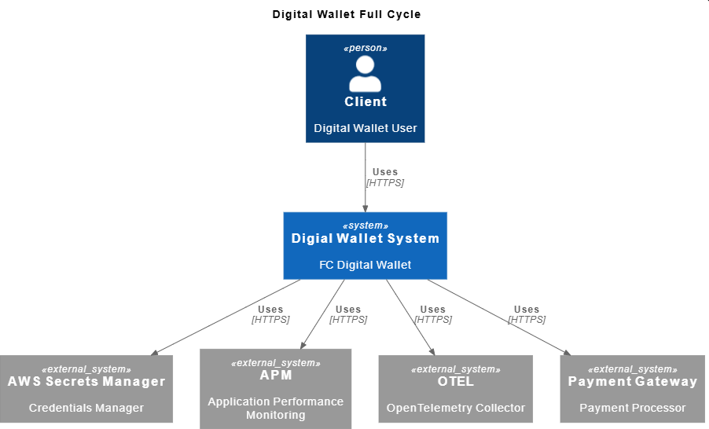
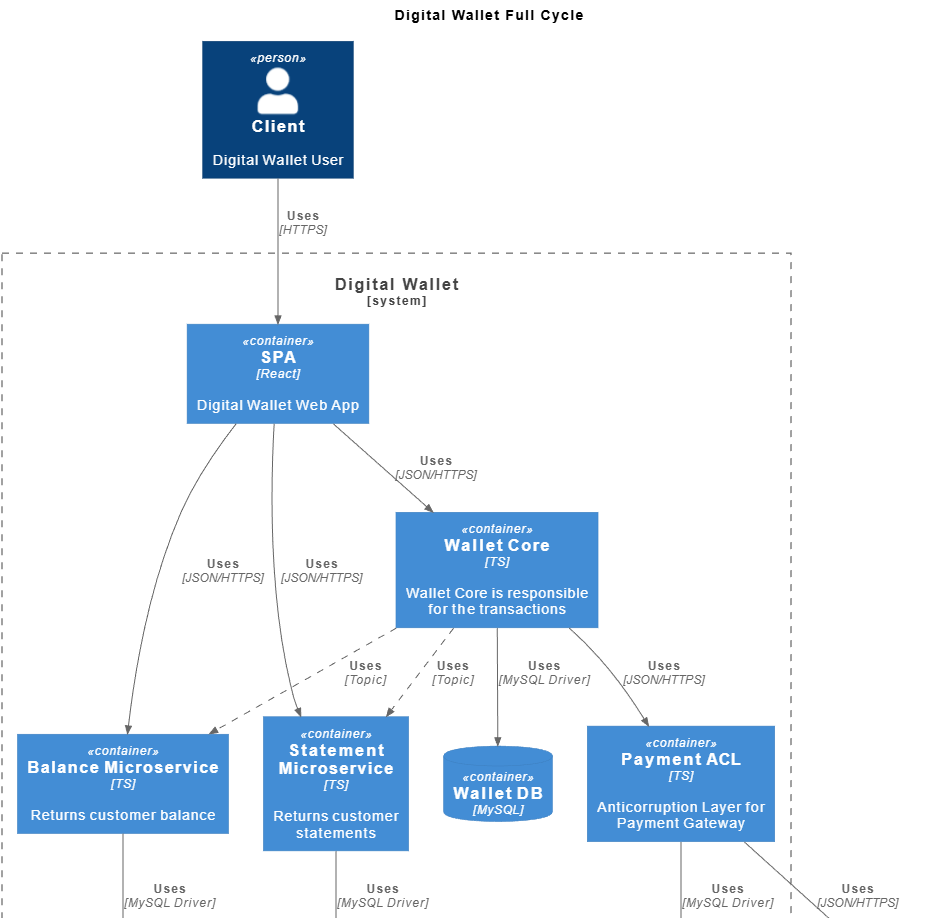

# projeto: digital wallet full cycle

### objetivo do projeto:
criar um microserviço(serviço especifico) e disparar eventos para o kafka

### caracteristicas:  
event-driven architecture, microservice, unit of work, messaging, kafka, asynchronous communication, unit test, integration test, transactional atomicity

### arquitetura: 

- não foi implementando todos os contexts, containers

  
description: c4-model - context. Para visualizar o restante usar o preview plantuml, na pasta /docs
  
description: c4-model - containers. Para visualizar o restante usar o preview plantuml, na pasta /docs

#### containers:  
	- microservice: wallet-core  
		- focado em clientes, contas e transações
		- sistema financeiro  
			- /GLOSSARY.md tem a linguagem ubiqua 
		- stack: go  
		- package: pkg
			- contem pacotes que podem ser compartilhados
		- como instalar tools go no vscode?  
			- instalar a extensão go
			- ctrl + shift + p  
			- go: install/update tools  
				- instalar tudo  		

#### ajuste para visualizar PlantUML no VSCode:
	- metodologia: C4 MODEL  
	- documentação em /docs

	1. Instale a extensão "PlantUML" (jebbs) no VSCode.

	2. Abra as configurações da extensão PlantUML:
		- Defina "Plantuml: Render" como `PlantUMLServer`
		- Defina "Plantuml: Server" como `http://plantuml-c4model:8080`

	3. Abra um arquivo `.puml` e utilize o preview do PlantUML no VSCode.

#### como usar o ambiente localmente? 
	- instalar go, docker
	- subir ambiente 
		- docker compose -f docker/docker-compose.yml up 
	- subir ambiente, apos atualizar docker file 
		- docker compose -f docker/docker-compose.yml up --build 
	- acessar microservice wallet-core 
		- docker-compose -f  docker/docker-compose.yml exec -it microservice-wallet-core bash 

#### como subir o ambiente usando devcontainer no vscode ou cursor? 
	- instalar extensão DevContainer
	- ctrl + shift + p  
	- escolher a opção "Dev Containers: Reopen in Container" 


#### comandos uteis
```bash
// iniciar webservice
go run cmd/wallet-core/main.go
```

#### executar testes go
```bash
// apartir da raiz
go test ./...
// apartir de um pacote
go test ../...
```

#### observações
	- extension vscode: REST Client
		- usada para testar a api
		- wallet-core/api/client.http

#### cenario 1, testando um fluxo com dev container
```bash
# resumo
	- ao entrar no dev container, todos os containers vao estar iniciados
	- configurar mysql acessando fora do dev-container
	- control-center-kafka, criar topicos
	- iniciar webservice
	- usar /api/client.http e mudar estado
	- verificar no controler-center-kafka se a message foi criada

# mysql
	docker ps
	docker exec -it docker-mysql-1 bash
	mysql -uroot -p wallet
	root

	CREATE TABLE clients (id VARCHAR(255) PRIMARY KEY, name VARCHAR(255), email VARCHAR(255), created_at date);
	CREATE TABLE accounts (id VARCHAR(255) PRIMARY KEY, client_id VARCHAR(255), balance INT, created_at date);
	CREATE TABLE transactions (id VARCHAR(255) PRIMARY KEY, account_id_from VARCHAR(255), account_id_to VARCHAR(255), amount INT, created_at date);

	# usar só se precisar
	select * from clients;
	select * from accounts;
	DROP TABLE clients;
	DROP TABLE accounts;
	DROP TABLE transactions;
	update accounts set balance=100 where id="3f06b755-b302-4a61-a8de-55b9a4dc14a1";

# control-center kafka
	- criar o topico transaction via porta localhost:9092, com partição 1
	- criar o topico balances via porta localhost:9092, com partição 1

# iniciar webservice
	go run cmd/wallet-core/main.go

```