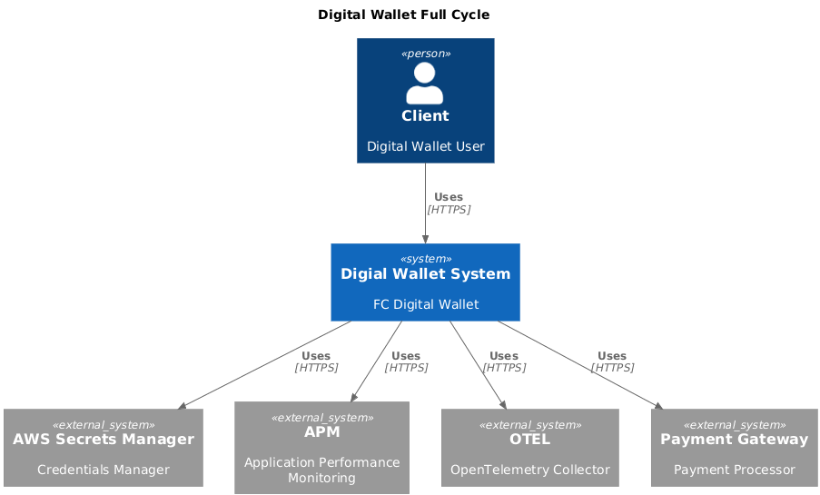
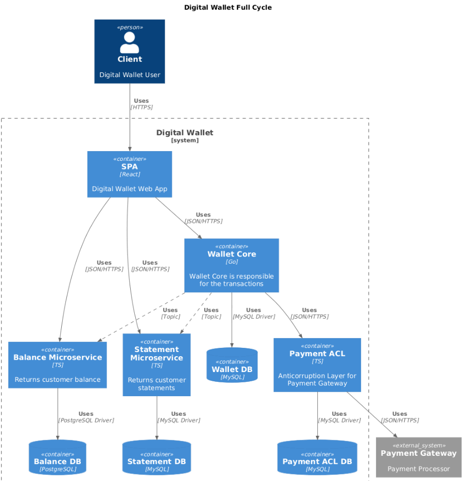

# projeto: digital wallet full cycle

### descrição
- simular sistema financeiro
- glossary em /docs/glossary.md

### objetivos:  
aplicar event-driven architecture, microservice, unit of work, messaging, kafka, asynchronous communication, unit test, integration test, transactional atomicity, c4 model

### arquitetura: 
- observação:
  - Não foi implementando todos os contexts, containers.
  - Para visualizar o restante usar o preview plantuml, na pasta /docs.

  
description: c4-model - contexts 

  
description: c4-model - containers. 

#### ajuste para visualizar PlantUML - C4 Model no VSCode:
- metodologia: C4 MODEL  
- documentação em /docs/c4-model

1. Instale a extensão "PlantUML" (jebbs) no VSCode.

2. Abra as configurações da extensão PlantUML:
    - Defina "Plantuml: Render" como `PlantUMLServer`
    - Defina "Plantuml: Server" como `http://localhost:8080`

3. Abra um arquivo `.puml` e utilize o preview do PlantUML no VSCode.

#### partes:
- Microservice: wallet-core  
    - Focado em clientes, contas e transações  
    - [Leia mais](./services/walletcore/readme.md)  
- Microservice: Balance  
    - Retorna apenas o saldo atual do cliente  
    - [Leia mais](./services/balance/readme.md)  
- Statement  
    - Não implementado  
    - Retornará o histórico detalhado das transações (extrato)  

#### tecnologias necessarias:
- docker

#### como usar o ambiente localmente? 
- instalar docker
- subir ambiente 
  - docker compose -f docker/docker-compose.yml up 
- subir ambiente, apos atualizar docker file 
  - docker compose -f docker/docker-compose.yml up --build 
- acessar microservice wallet-core 
  - docker-compose -f  docker/docker-compose.yml exec -it microservice-wallet-core bash 

#### como subir o ambiente usando devcontainer no vscode ou cursor? 
- vantagem:
  - instala extensoes vscode para cada container, traz intelisense
- instalar extensão DevContainer
- usar docker compose up no projeto inteiro
- abrir o cursor em uma pasta separada para cada e fazer o passo a seguir
- ctrl + shift + p  
- escolher a opção "Dev Containers: Reopen in Container" 

#### cenario de teste rapido:
- o docker compose ao iniciar já aplica o seed e inicia os webservices e components.
- o kafka cria os topicos automaticamente, você pode ver no control-center em http://localhost:9022/.
- seed;
  - dois usuarios já criados no walletcore com as accounts replicadas no balance.
- teste:
  executar ./services/balance/client.http com a extensão rest client para consultar account existente.